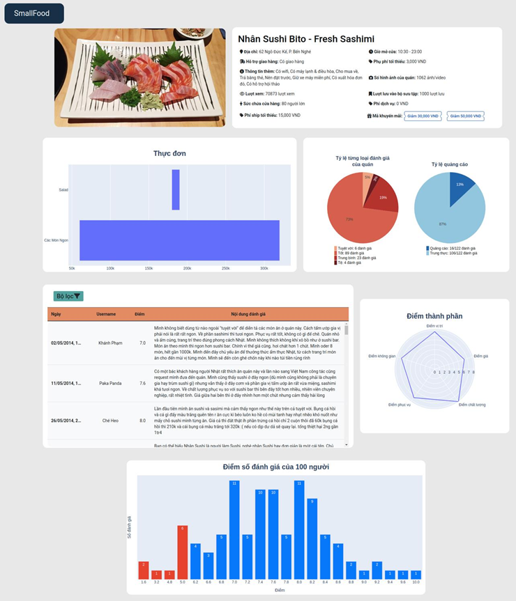
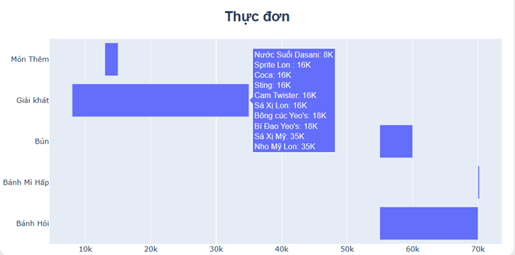
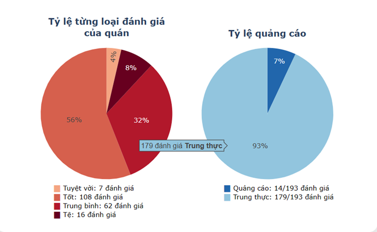
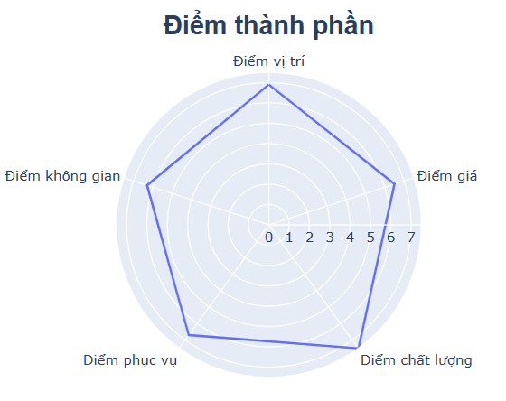
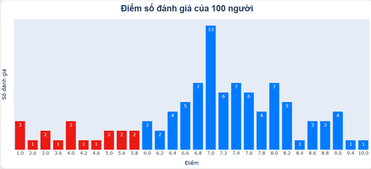
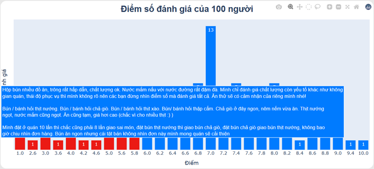
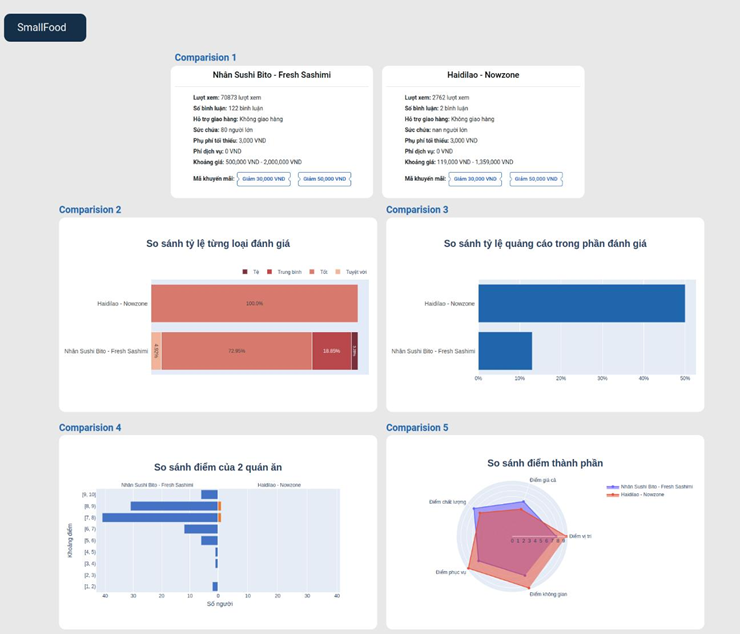
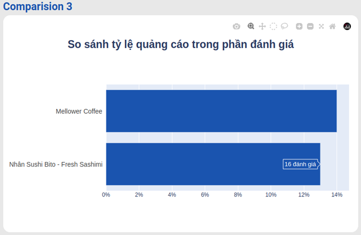

# Foody-Crawling-Analysis-Dashboard
## Bối cảnh
Với xu thế đặt món ăn trên các ứng dụng như Foody, GrabFood,... thì người dùng càng trở nên cân nhắc hơn trước khi chốt đơn. Họ có xu hướng căn cứ vào rating của quán ăn & các đánh giá từ những thực khách trước đây để đưa ra quyết định. Tuy nhiên ở nhiều quán ăn, nhằm tăng độ nhận diện thương hiệu mà phần lớn đánh giá là đánh giá thiếu trung thực hoặc seeding nên rating thường rất cao (9.6 - 10 điểm), từ đó gây khó khăn cho người dùng vì phải liên tục kiểm tra 1 quán ăn có nhiều đánh giá kiểu như vậy không. Bên cạnh đó trang chủ Foody chưa có cơ chế sắp xếp món ăn theo giá từ nhỏ tới lớn nên sẽ gây mất thời gian trong việc tìm kiếm
Mục tiêu của nhóm hướng tới gồm:
- Phân tích & trực quan hóa diện rộng: phân tích dữ liệu cơ bản với dữ liệu cào được trong thư mục `data_crawling`, quan sát tình trạng/ xu hướng của 1 nhóm các quán ăn. Đây cũng là tiền đề để nhóm chọn lọc thuộc tính và phát triển mục tiêu 2
- Xây dựng web dashboard tương tác được với người dùng với các chức năng phục vụ cho việc quan sát số liệu của từng quán đơn lẻ (tỷ lệ seeding, tỷ lệ từng loại đánh giá, phân phối điểm rating từ 1 - 10 và đánh giá tương ứng), hỗ trợ so sánh giữa 2 quán bất kỳ, public mã giảm giá một cách tường minh,...

## Dữ liệu
Dữ liệu được thu thập là thông tin các quán ở 24 quận trong TP.HCM. Thu thập bằng 2 cách:
- **Thông qua API**: ta lấy các thông tin cơ bản như loại hình quán ăn (nhà hàng, quán nhậu,...), loại ẩm thực (món Á, Âu,...), phí dịch vụ, mã giảm giá, đơn hàng tối thiểu để áp dụng mã giảm; thông tin menu 
- **Cào trực tiếp từ web**: sử dụng scrapy + selenium để cào đánh giá người dùng, rating, điểm từng phần,...

## Mục tiêu 1: Phân tích dữ liệu
Tham khảo file `slide.pptx`, một số câu hỏi nổi bật gồm:
- Thống kê những quán có mã giảm giá
- Để áp dụng mã thì đơn hàng tối thiểu bao nhiêu tiền?
- Xu hướng ẩm thực & mô hình dịch vụ ở HCM
- Giá cả có phải yếu tố then chốt ảnh hưởng tới rating tổng thể?
- Anomaly detection: phân tích tương quan giữa số đánh giá tốt với tổng số đánh giá để coi có gì bất thường không. Sau đó chọn ra 37303 quán ăn và chạy mô hình [spam detection](https://github.com/sonlam1102/vispamdetection) (sai số: 10%) và thấy rằng khoảng 21% số quán ăn có tỷ lệ đánh giá seeding cao 
- ...

## Mục tiêu 2: Web dashboard
- Tech: Django, Plotly
- 1 số chức năng nổi bật được liệt kê phía dưới
### Trang dashboard cho mỗi quán ăn
Gồm 4 biểu đồ tóm tắt thông tin cho quán ăn đó

    

- **Biểu đồ thực đơn**: thể hiện chủ đề món chính và phạm vi giá cả của nó. Bên cạnh đó, khi di chuột vào 1 thanh giá bất kì, 1 pop-up hiển thị ra menu gồm các món ăn và giá theo thứ tự từ thấp đến cao của món chính tương ứng. Ví dụ: khi di chuột vào thanh ngang thể hiện khoảng dao động giá của món chính Giải khát, thì các món nước nằm trong mục Giải khát gồm: Nước Suối Danasi (rẻ nhất),…, nước Nho Mỹ Lon (mắc nhất)

    

- **Biểu đồ tròn**: thể hiện tỷ lệ từng loại đánh giá và tỷ lệ quảng cáo của quán. Ngoài chú thích dưới hình, ta có thể di chuột vào vào từng cung tròn để xem có bao nhiêu đánh giá thuộc loại bất kỳ nào đó.

    

- **Biểu đồ radar chart**: giúp người dùng có cái nhìn dễ dàng hơn điểm mạnh, yếu và điểm tối đa của từng yếu tố. Ví dụ hình dưới, quán này có yếu tố cao điểm nhất chỉ vào 7.5 điểm dựa theo thanh điểm; có thế mạnh (góc nhô ra nhiều nhất) về chất lượng món ăn (7.5d). Ta cũng có thể di chuột vào từng góc biểu đồ để hiển thị điểm thành phần

    

- **Biểu đồ phân phối rating chấm bởi tất cả thực khách**: giúp khách hàng có thể so sánh về phân bố điểm số mà các khách hàng trước đã đánh giá cho quán này. Trục Ox thể hiện điểm trên thang 10, trục Oy thể hiện số đánh giá của điểm tương ứng. Ví dụ hình dưới, thấy rằng có khá nhiều người dùng (13 người) đánh giá quán 7 điểm

    

Tương tự như các biểu đồ trước, ta có thể di chuột vào từng thanh dọc để hiển thị popup khoảng 2-3 đánh giá đại diện mới nhất cho cột điểm đó, mỗi đánh giá cách nhau 1 hàng

    

## Trang so sánh 2 quán ăn
Trang so sánh dùng để so sánh thông tin quan trọng của 2 quán ăn, giúp cho người dùng dễ dàng hình dung sự khác biệt giữa 2 quán và rút ra ưu điểm và nhược điểm của từng quán ăn

    

Tương tự với trang dashboard cho từng quán ăn, ta có thể di chuột vào từng biểu đồ để hiện thị pop-up chi tiết cho từng hạng mục. VD ở Comparison 3:

    

